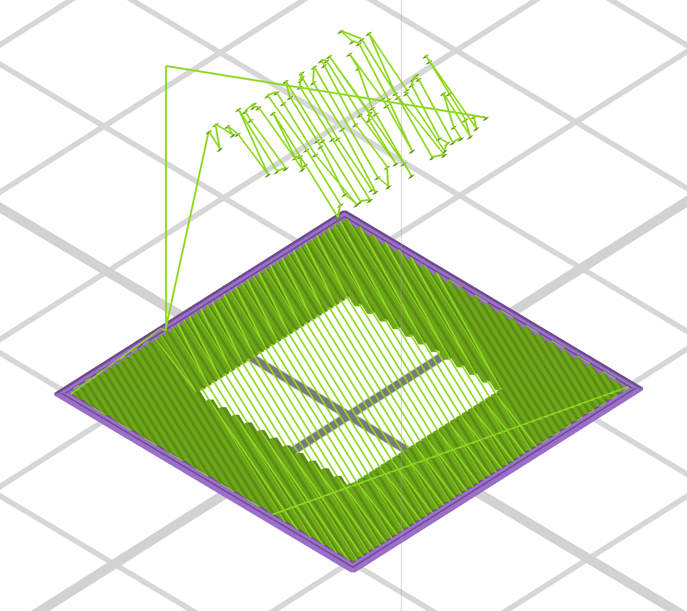
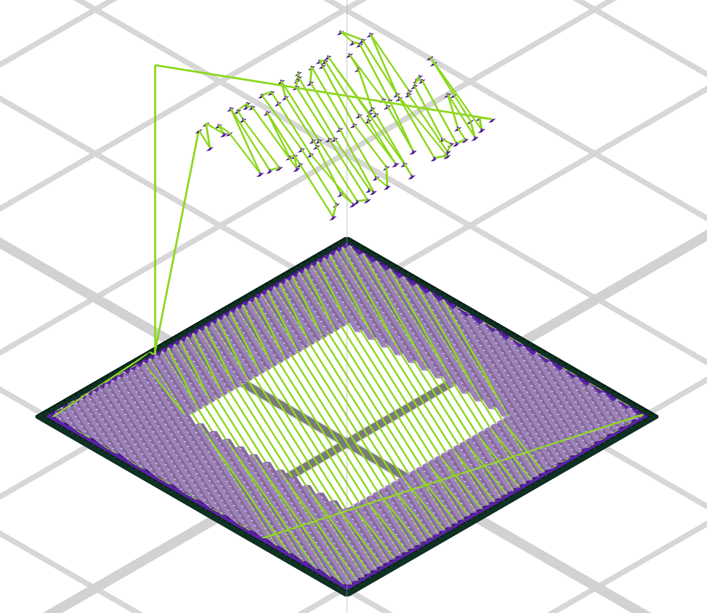
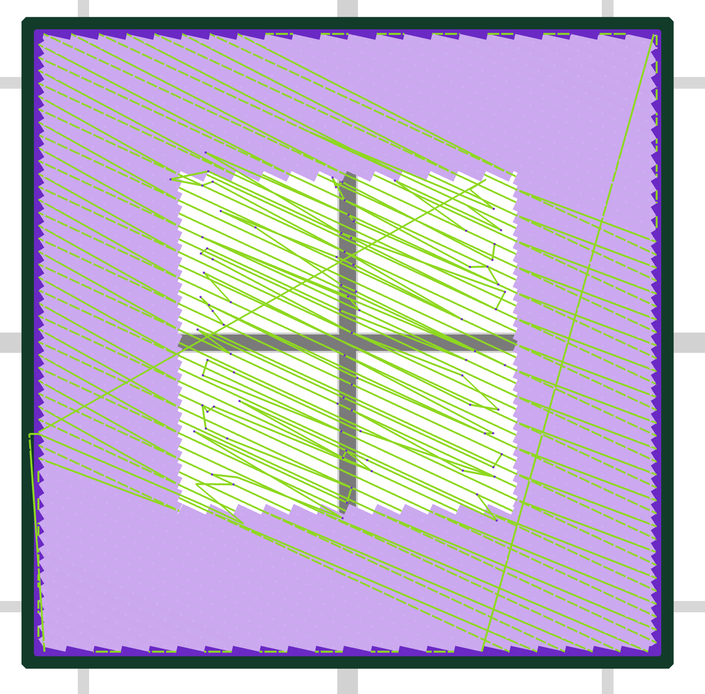

# Localized Gradient Density MPF/G-code Post Processor

This script will replace bounded infill areas in MPF/G-code files with single location extrusions approximating a lower density infill. This is made to process files in the MPF format generated by Additec ElemX Builder 3.4.4 (formerly owned by Xerox) to be printed on the ElemX Plus Liquid Metal Jet (LMJ) printer.


https://raw.githubusercontent.com/ansonl/elemx-density/refs/heads/master/assets/prusa-gcode-final-feature-preview.mp4

https://raw.githubusercontent.com/ansonl/elemx-density/refs/heads/master/assets/elemx-pyramid-z-offset-flip-direction-features.mp4


## Features

- Modify G-code moves to print a defined region with variable density infill. 
  - Moves are split along the edges of the bounding box.

- Variable density infill starting percentage can be set by the user. 

- Solid infill in the variable density region is converted to fixed position extrusions (droplets).
  - All consecutive infill movements are queued to be written in the output file because the extrusion droplets must be evenly distributed across all infill movements to meet the mass (density) requirement. The first non-infill movement triggers the processing of all queued movements which are most likely within a printing "island".
  - Infill droplet placement can have an inset from the bounding box edge to avoid droplet build up on the walls. `MINIMUM_INSET_DROPLET_WIDTH`
  - Droplet extrusion multiplier from ideal mass can be set to compensate for real life printer issues `DROPLET_EXTRUSION_MULTIPLIER`
  - Consecutive travel moves without extrusion are combined to reduce the number of redundant travel moves. 

- Solid infill lines that are outside the bounding box can be flipped to always print towards the center of the region for better overhangs `FLIP_MOVEMENT_TO_MOVE_TOWARDS_INTERSECTING_BOUNDING_BOX`.

- Droplet locations are tracked using a 2D raster with adjustable resolution `DROPLET_RASTER_RESOLUTION_PERC. The resolution of the raster should be a power of `1/2` (0.5/0.25/0.125/etc)
  - A "supported search" kernel checks for supported locations to place droplets on the current layer. The droplet locations on the previous layer determine if a location is supported. 
  - A "collision search" kernel checks for overlapping droplet locations on the current layer that are already taken and thus unsuitable for more droplet placement. 
  - Both kernel radius' and corner radius' can be adjusted. The corner radius can be increased to better approximate a circular region.

- Variable density infill can be extruded with the printhead raised farther above the buildplate than normal using `INFILL_Z_OFFSET`. This will allow droplets more time to cool when falling and reduce the splattering effect.

- The sides of the variable density region will gradually fill in towards the center of the region as the printing reaches of the top layer of the region. Overlap percentage can be adjusted `INFILL_BB_SIDES_FILL_IN_DROPLET_OVERLAP_PERC`

- Droplets in output G-code can be made viewable in ElemX Builder preview by setting `ADD_ELEMX_PREVIEW_MOVE` and `DWELL_BEFORE_EXTRUDE` to True.
  - **These preview settings MUST be set to False when producing an MPF file for actual printing. **





- Perimeter renaming bypasses the print opt to avoid crashing the printer. 

## Parameters

Parameters in `constants.py`

Bounding box is currently defined at top of `mpf_post_process.py`

## Run

Run `mpf_post_process.py`

## Settings

The bounded area is specified similar to a modifier cube in 3D slicer software. Bounding box for modified infill volume is set in `testBoundingBox` in `mpf_post_process.py`.

The new infill is only placed where previous layers have modified infill so that the infill stacks on top of lower layers. A 50% overlap is currently hardcoded.

Most constants are defined in the `constants.py` file and classes defined for printing are in `printing_classes.py`.

The input and output files can be set at the bottom of `mpf_post_process.py` by modifying the line

```python
process(inputFilepath='test-square.mpf', outputFilepath='test-square-output.mpf')
```

The user assumes all risk and liability when running code and output data in this repository.